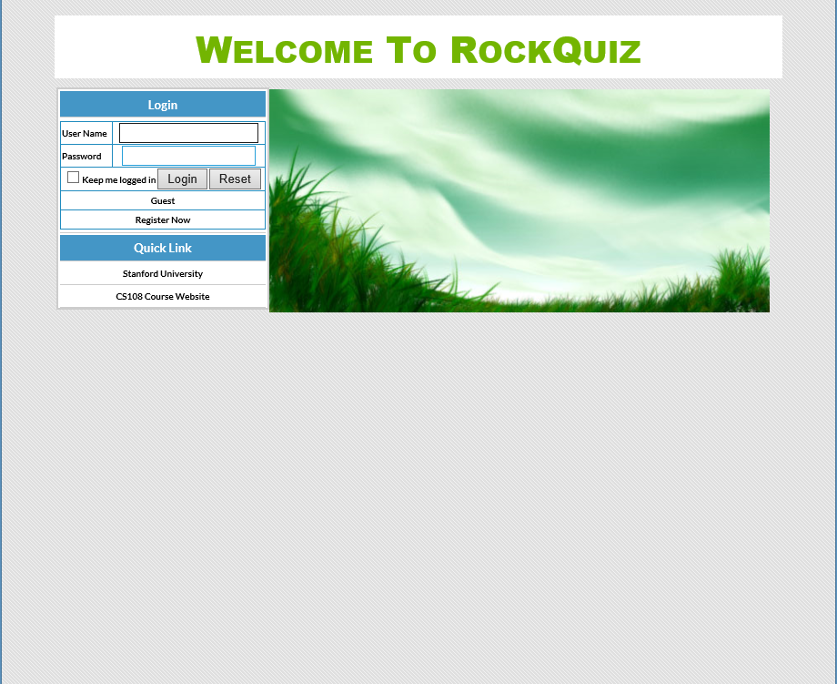
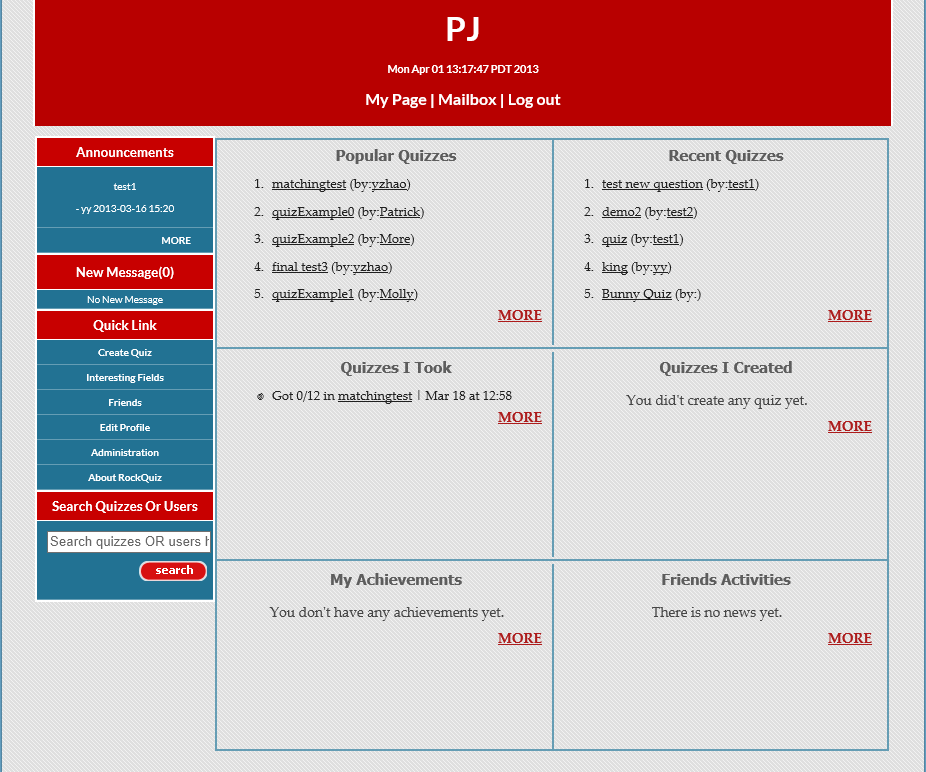
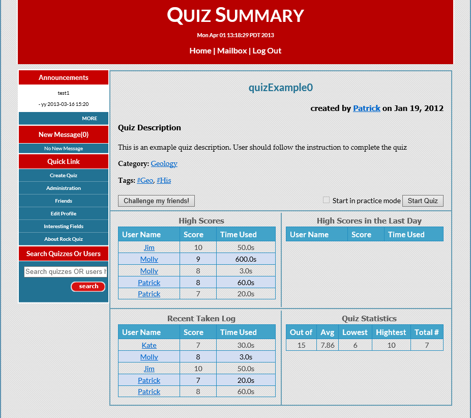
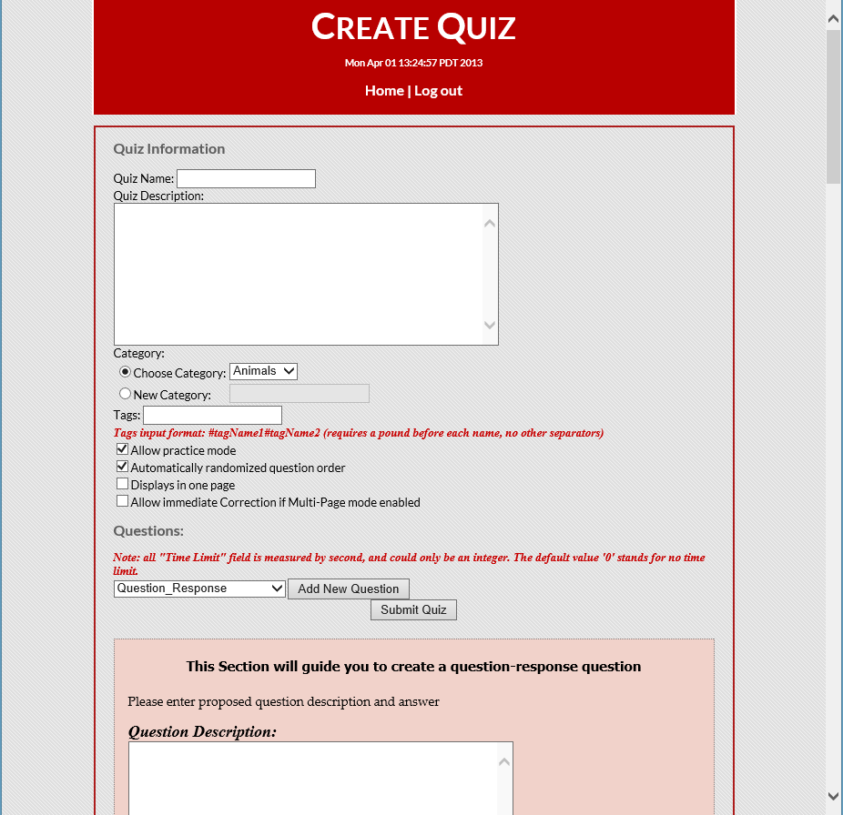
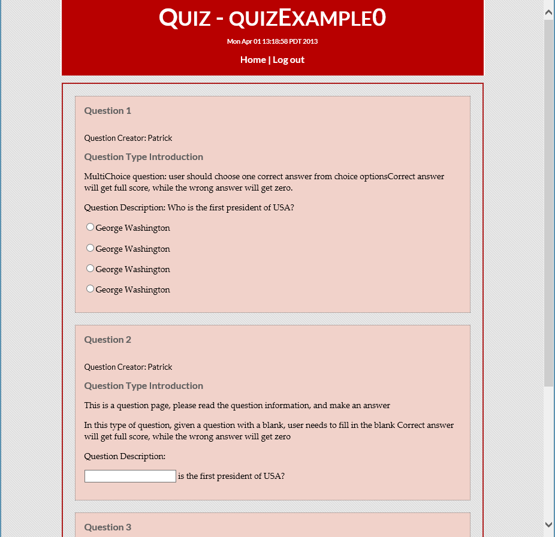
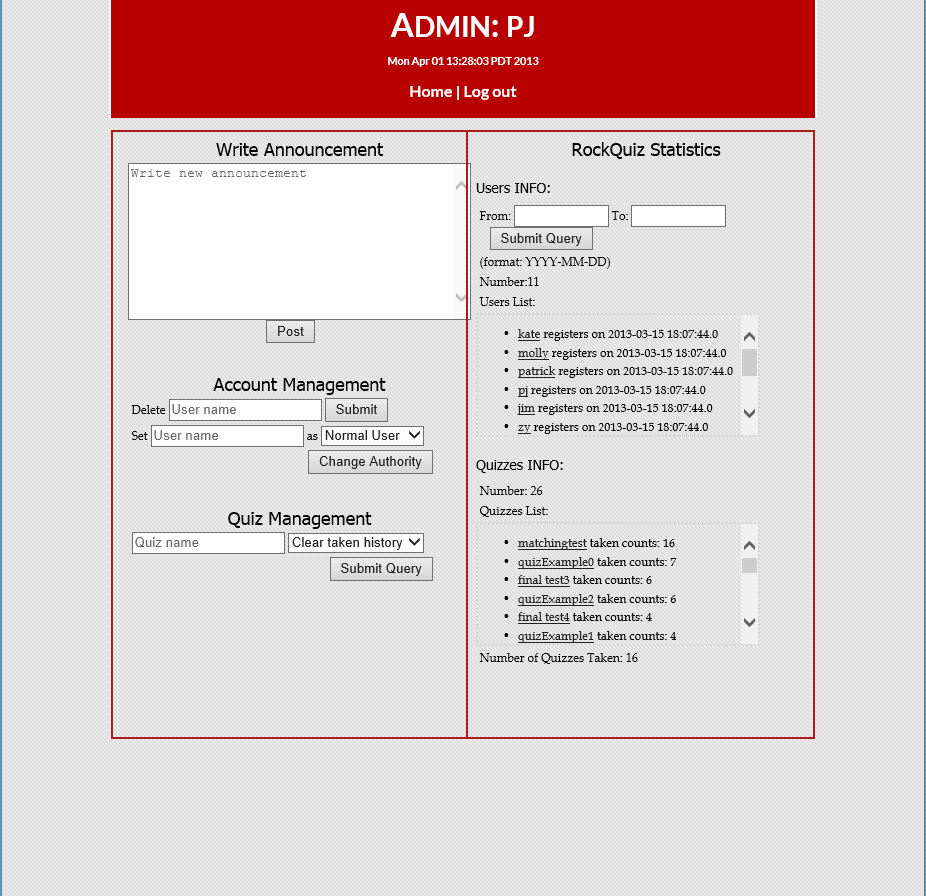
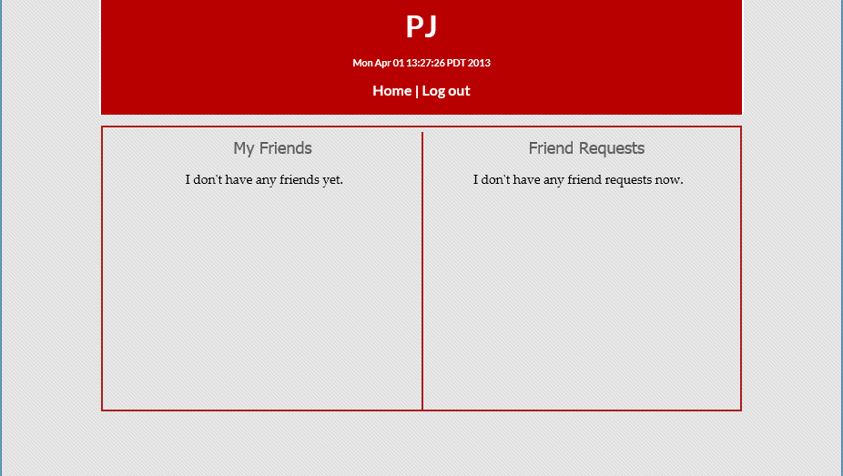
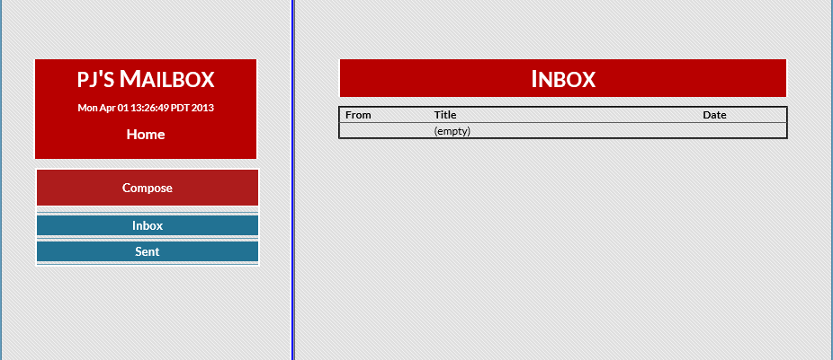
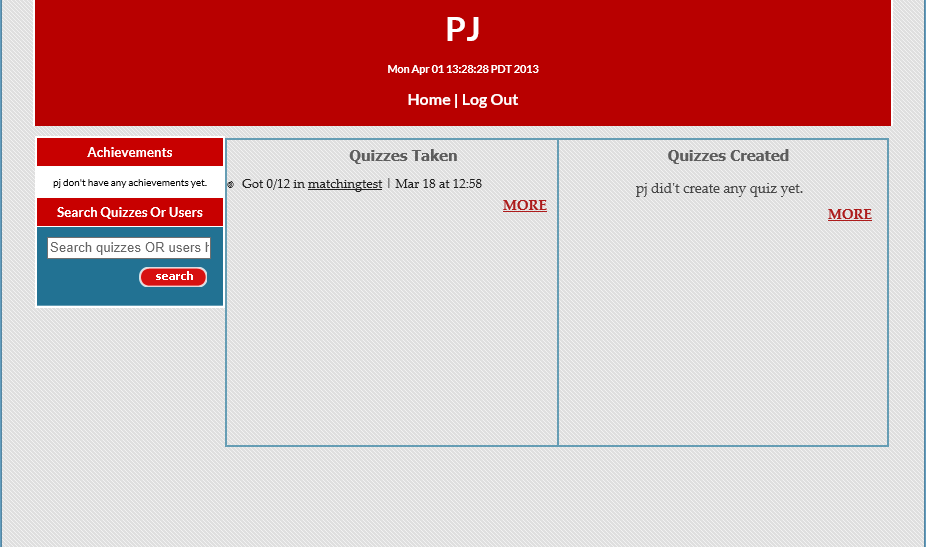

RockQuiz
========

_RockQuiz_ is a class project (Quiz Website) for CS 108 at Stanford University.
RockQuiz is opensourced under [MIT license](http://opensource.org/licenses/mit-license.php).

Usage
-----
This is a Eclipse Java EE project. 
1. Import this project into Eclipse to work with.
2. Setup Tomcat v7 Apache Server for Eclipse.
3. Setup MySQL server and modify corresponding configurations in src/database/MyDB.java
and src/user/UserManager.java

Copyright & License
-------------------
The MIT License (MIT)
Copyright (c) 2013 Jing Pu, Yang Zhao, You Yuan, Huijie Yu 

Permission is hereby granted, free of charge, to any person obtaining a copy
of this software and associated documentation files (the "Software"), to 
deal in the Software without restriction, including without limitation the
rights to use, copy, modify, merge, publish, distribute, sublicense, and/or 
sell copies of the Software, and to permit persons to whom the Software is 
furnished to do so, subject to the following conditions:

>The above copyright notice and this permission notice shall be included in 
>all copies or substantial portions of the Software.
>
>THE SOFTWARE IS PROVIDED "AS IS", WITHOUT WARRANTY OF ANY KIND, EXPRESS OR 
>IMPLIED, INCLUDING BUT NOT LIMITED TO THE WARRANTIES OF MERCHANTABILITY, 
>FITNESS FOR A PARTICULAR PURPOSE AND NONINFRINGEMENT. IN NO EVENT SHALL THE 
>AUTHORS OR COPYRIGHT HOLDERS BE LIABLE FOR ANY CLAIM, DAMAGES OR OTHER 
>LIABILITY, WHETHER IN AN ACTION OF CONTRACT, TORT OR OTHERWISE, ARISING FROM, 
>OUT OF OR IN CONNECTION WITH THE SOFTWARE OR THE USE OR OTHER DEALINGS IN 
>THE SOFTWARE.

Screenshots
-----------

